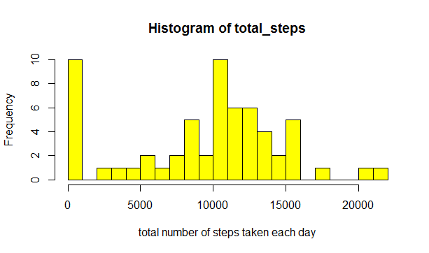
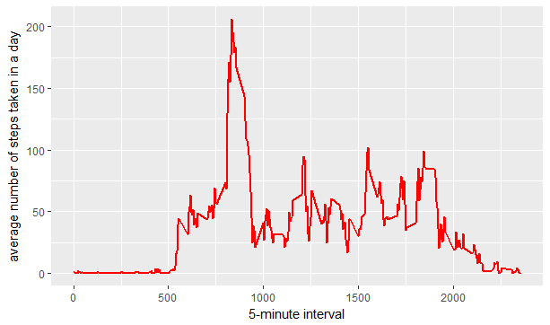
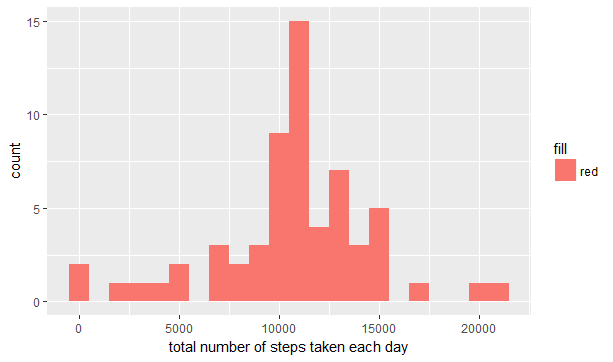

```{r setup, include=FALSE}
knitr::opts_chunk$set(echo = TRUE)
```

## R Markdown

## Loading and preprocessing the data
```{r echo = TRUE}
 data <- read.csv("activity.csv")
```


## What is mean total number of steps taken per day?
```{r echo=TRUE, message=TRUE, include=TRUE}
total_steps <- tapply(data$steps, data$date, FUN = sum, na.rm = TRUE)
hist(total_steps, breaks = 30, xlab = "total number of steps taken each day", col ="yellow" , border = "black")

```


```r
mean(total_steps, na.rm = TRUE)
```

```
## [1] 9354
```

```r
median(total_steps, na.rm = TRUE)
```

```
## [1] 10395
```


## What is the average daily activity pattern?
```{r echo = TRUE}
library(ggplot2)
averages <- aggregate(x = list(steps = data$steps), by = list(interval = data$interval), FUN = mean, na.rm = TRUE)
ggplot(data = averages, aes(x = interval, y = steps)) + geom_line(col = "red", lwd = 1) + xlab("5-minute interval") + 
    ylab("average number of steps taken in a day")
```


## Which 5-minute interval, on average across all the days in the dataset, contains the maximum number of steps?

```r
averages[which.max(averages$steps), ]
```

```
##     interval steps
## 104      835 206.2
```

## Inputing missing values:
There are many days/intervals where there are missing values (coded as `NA`). The presence of missing days may introduce bias into some calculations or summaries of the data
```{r echo = TRUE}
missing <- is.na(data$steps)
summary(missing)
```
```
## missing
## FALSE  TRUE 
## 15264  2304
```


All of the missing values are filled in with mean value for that 5-minute
interval.

```{r echo = TRUE}
# Replace each missing value with the mean value of its 5-minute interval
fill.value <- function(steps, interval) {
    filled <- NA
    if (!is.na(steps)) 
        filled <- c(steps) else filled <- (averages[averages$interval == interval, "steps"])
    return(filled)
}
filled.data <- data
filled.data$steps <- mapply(fill.value, filled.data$steps, filled.data$interval)
```
Now, using the filled data set, let's make a histogram of the total number of steps taken each day and calculate the mean and median total number of steps.

```{r echo = TRUE}
total_steps <- tapply(filled.data$steps, filled.data$date, FUN = sum)
qplot(total_steps, binwidth = 1000, xlab = "total number of steps taken each day", bg = "red")
```
 


## Are there differences in activity patterns between weekdays and weekends?
```{r echo = TRUE}

```


